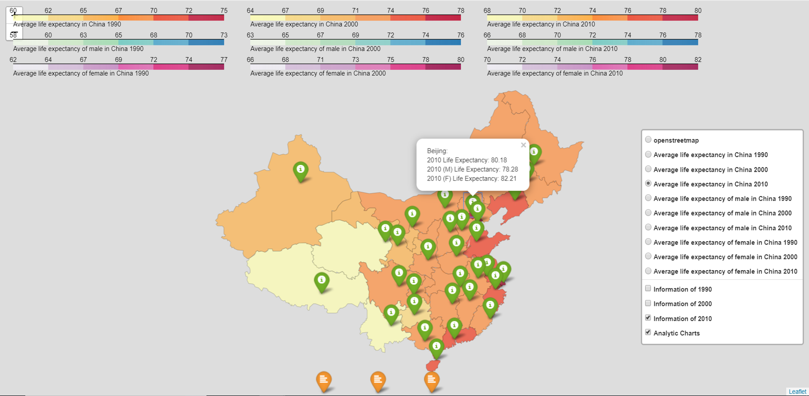

# China Life Expectancy Project  
##### Author:  ***Shuai Fang***
## Project Descripttion: 
This project use python packages to visualize Chinese 1990, 2000, 2010’s Life Expectancy data. In order to serve in a bilingual environment, we provide the life expectancy result maps in both Chinese and English. We recommend users download the whole project to their local device and open the html files to experience the interactive functions.

## Structure:
There are three useful folders included in this Repo. 
1. DataSet: 
- Data_0 is the original file that only includes Chinese Life Expectancy information 
- Data_1 is the file for essential use of program. The raw data include the name and location (Lat, Lon) of the province, the life expectancy by years and genders. 
- Indicator is the file includes selected indicators from the World Bank. It is the data set for analytic report.
-CHN-provinces is the json file for the base map
2. Code: 
- In this folder we include three ipynb files (python notebook) for, maps in Chinese and English result map and analytic report. It needs to be emphasized that before running the program make sure give the correct path for input file.
3. Result: 
- “China 1990, 2000, 2010 life expectancy (EN).html” is the English version of the result map
- “中国1990，2000，2010预期寿命可视化图.html” is the Chinese version of the result map

## App Introduction 

