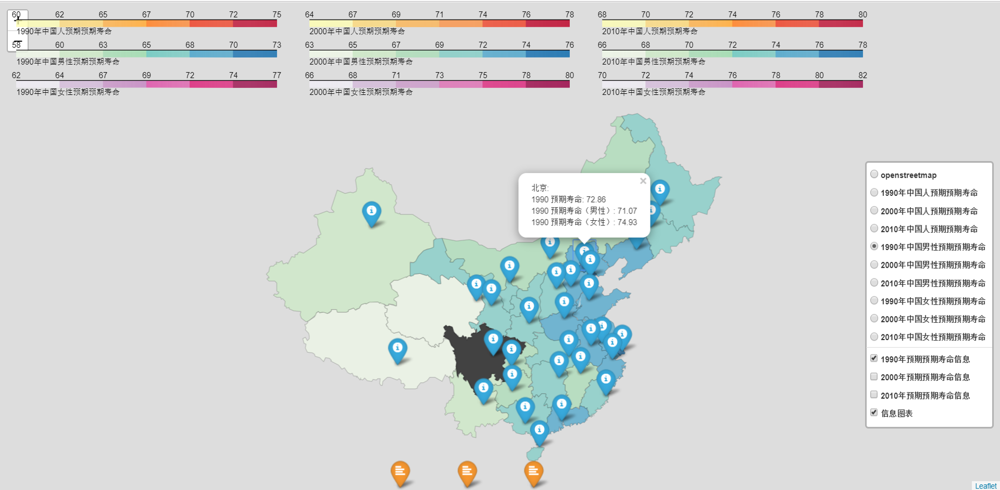
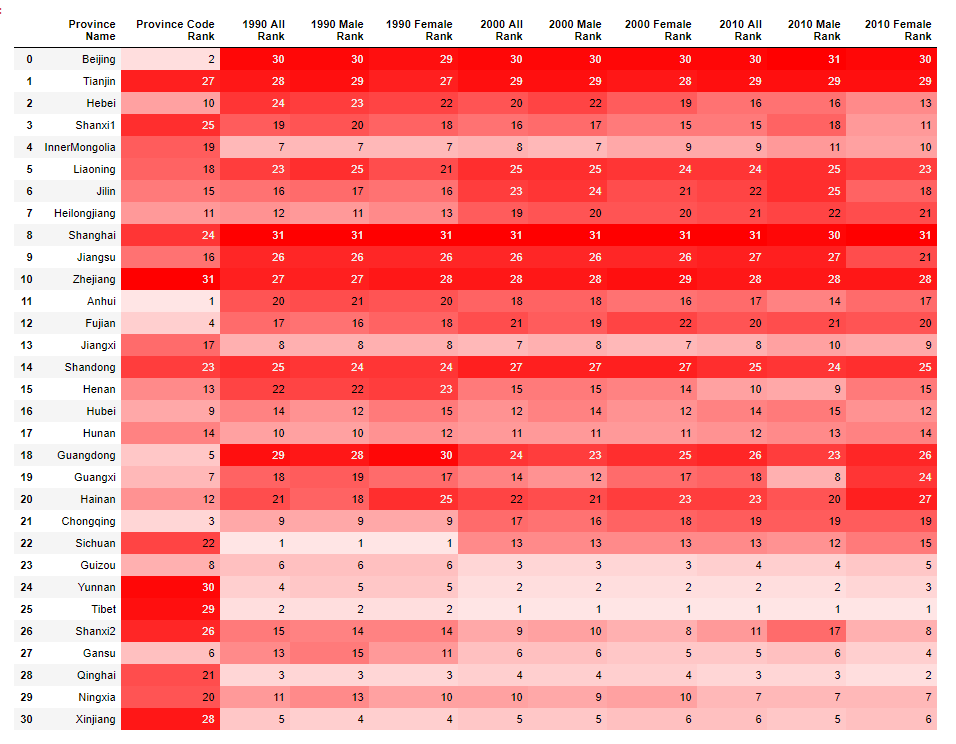
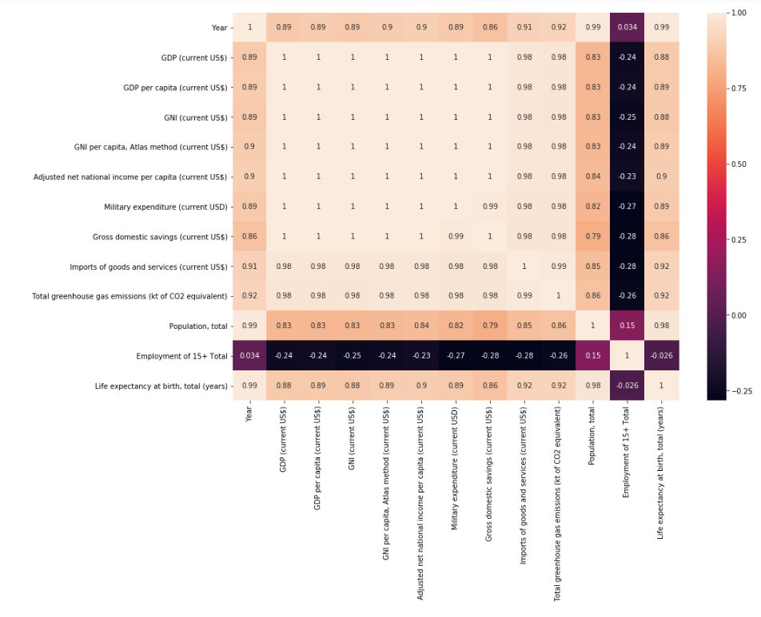

# China Life Expectancy Project  
##### Author:  ***Shuai Fang***
## Project Descripttion: 
This project use python packages to visualize Chinese 1990, 2000, 2010’s Life Expectancy data. In order to serve in a bilingual environment, we provide the life expectancy result maps in both Chinese and English. We recommend users download the whole project to their local device and open the html files to experience the interactive functions.

## Structure:
There are three useful folders included in this Repo. 
1. DataSet: 
- Data_0 is the original file that only includes Chinese Life Expectancy information 
- Data_1 is the file for essential use of program. The raw data include the name and location (Lat, Lon) of the province, the life expectancy by years and genders. 
- Indicator is the file includes selected indicators from the World Bank. It is the data set for analytic report.
- CHN-provinces is the json file for the base map
2. Code: 
- In this folder we include three ipynb files (python notebook) for, maps in Chinese and English result map and analytic report. It needs to be emphasized that before running the program make sure give the correct path for input file.
3. Result: 
- “China 1990, 2000, 2010 life expectancy (EN).html” is the English version of the result map
- “China 1990, 2000, 2010 life expectancy (CN).html” is the Chinese version of the result map

## App Introduction:
### Part I:
If you open the project map (HTML files) correctly, you will see the interactive map shown in below:
-	You can choose different layers from layer box. Layers can display the choropleth map by different years and genders. 
-	You can click the information popup icons on the map. It shows the information for each province.
-	You can click the analytics popup icons on the lower side of the map. It shows the base descriptive result of the data by different years 

### Part II:
In below it is the same choropleth map but displayed in Chinese:

### Part III:
We use Python Seaborn Package to visualize a “Heat Map” of the life expectancy ranks:

We use Python Seaborn Package to show the correlation in between the World Bank indicators and life expectancy:
The last raw (column) of the matrix shows the correlation in between life expectancy and 12 indicators we selected from the World Bank database. We can find that the population, income and imports of good and service have significant positive impact for life expectancy and employment have negative relation with life expectancy.

## Reference
Data Resources:
- The World Bank: "https://data.worldbank.org/country/china"
- China National Bureau of Statistics of China: "http://data.stats.gov.cn/"
- China National Health Commission: "http://www.nhc.gov.cn/zhuz/web/ydd.shtml" 
- China National Health and Family Planning Commission 

Pyhton Visualization Packages:
- Folium: "https://python-visualization.github.io/folium/"
- Seaborn: "https://seaborn.pydata.org/"

## License

- **[MIT license](http://opensource.org/licenses/mit-license.php)**
